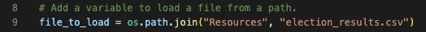

# Colorado Congressional Precinct Election Analysis

## Project Overview
A Colorado Board of Elections employee outlined the following tasks to complete the election audit of a recent local congressional election.

1. Calculate the total number of votes cast.
2. Get a complete list of candidates who received votes.
3. Calculate the total number of votes each candidate received.
4. Calculate the percentage of votes each candidate won.
5. Determine the winner of the election based on popular vote.
6. Get a complete list of counties where votes were cast.
7. Calculate the total number of votes cast in each county.
8. Calculate the percentage of total votes for each county.
9. Determine the county returning the largest number of votes in this election. 

## Resources
- Data Source: election_results.csv
- Software: Python 3.9.13, Visual Studio Code 1.72.2

## Election Audit Results
The analyses of the election show that:
- There were 369,711 votes cast in the election.
  - Below is the refactorable code which begins by setting a variable for total vote count.


- Congressional vote totals by county:
  - Jefferson: 10.5% (38,855)
  - Denver: 82.8% (306,055)
  - Arapahoe: 6.7% (24,801)
    - Below is the code for determining vote count per county along with percentage of total votes in the election. A dictionary ```county_votes``` was created to hold ```county_name``` ask key and ```votes``` as value. 


- The candidates:
  - Charles Casper Stockham
  - Diana DeGette
  - Raymon Anthony Doane
- The candidate results:
  - Charles Casper Stockham received 23.0% of the votes and 85,213 votes.
  - Diana DeGette received 73.8% of the votes and 272,892 votes.
  - Raymon Anthony Doane received 3.1% of the votes and 11,606 votes.
- The winner of the election:
  - Diana DeGette, who received 73.8% of the vote and 272,892 votes.
  

## Election Audit Summary
  This audit of the results from mail-in ballots, punch cards, and DRE counting machines for a U.S. congressional precinct in Colorado was performed successfully with Python. This audit could have been completed using Excel, but by automating the process using Python, we are able to apply the Python script to audit other elections, including senatorial and local elections. The changes to the script for future election audits should include the following: 
  - Reading the correct .csv input file for the district in line 9.

  

  - Adjusting the variables in line 51 from "county" to "district" or "state", as needed for areas of other elections being audited.

  
  - Adjusting the Election Results print out in line 88 to reflect geography (county, district, or state)

  
  
